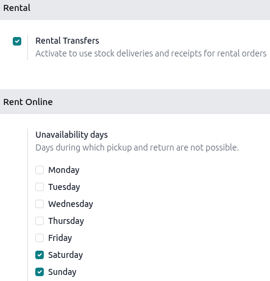

:show-content:

======
Rental
======

The Odoo **Rental** application provides comprehensive solutions for configuring and managing
rentals.

Send quotations, confirm orders, schedule rentals, register products upon pickedup and returned, and
invoice customers from a single platform.

.. seealso::
   - `Odoo Rental: product page <https://www.odoo.com/app/rental>`_
   - `Odoo Tutorials: Rental <https://www.odoo.com/slides/rental-48>`_

.. cards::

   .. card:: Rental products
      :target: rental/products
      :large:

      Explore how to create and manage rental products.

   .. card:: Service products
      :target: rental/service_products
      :large:

      Discover how to rent services alongside products.
   .. card:: Manage deposits
      :target: rental/manage_deposits
      :large:

      Learn how to create a refundable deposit for rental products.

Settings
========

To configure transfer locations and rental item availability, go to :menuselection:`Rental app -->
Configuration --> Settings`.

In the :guilabel:`Rental` section, enable :guilabel:`Rental Transfers` to use stock deliveries and
receipts for rental orders.

If a rental business has :ref:`multiple locations <rental/multi-location-management>`, rental
products can be transferred and tracked between them.

In the :guilabel:`Rent Online` section, designate :guilabel:`Unavailability days`, when pickup and
return are not allowed.

Price computing
===============

Odoo uses two rules to compute the price of a product when a rental order is created:

#. Only one price line is used.
#. The cheapest line is selected.

.. exercise::
   Consider the following rental pricing configuration for a product:

   - 1 day: $100
   - 3 days: $250
   - 1 week: $500

   A customer wants to rent this product for eight days. What price will they pay?

   After the order is created, Odoo chooses the second line because it is the lowest price. The
   customer pays three times the '3 days' rate to cover eight days, totaling $750.

   .. math::
      3~\text{days} + 3~\text{days} + 3~\text{days} = 9~\text{days}

      250 + 250 + 250 = $750

.. toctree::
   rental/products
   rental/service_products
   rental/manage_deposits

